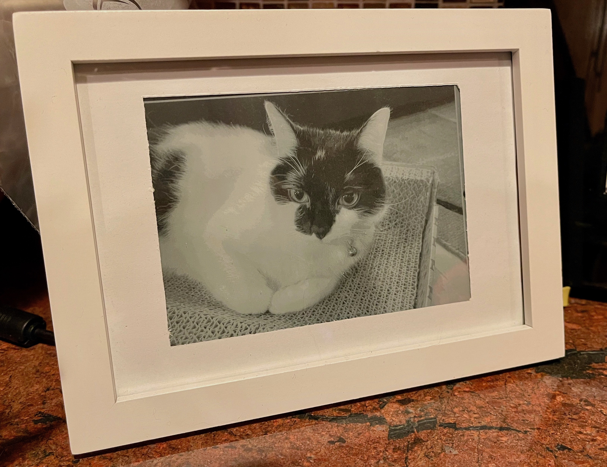

# eink-frame

What's cooler than a regular picture frame? A picture frame that can change its own picture!

This project combines an e-paper display (EPD) with a simple web interface where you can upload pictures right from your phone. Unlike an LCD display, the EPD display has no backlight and has the appearance of paper, helping it blend in and look more like a real 'analog' picture.

## Architecture

### Hardware
The picture frame described in this repo is made up of 2 components:

* Raspberry Pi 3B
* Waveshare 6 inch EPD display, 1448x1072 pixels, with Raspberry Pi HAT

From the front, the frame blends in with any other picture frame on the shelf. The Raspberry Pi is attached to the back and the display is inserted in the frame where a photo would normally go.

The display has a pretty high resolution and, crucially for pictures, 4 bits per pixel. Aka, up to 16 different levels of black/white for each pixel. Displaying pictures on an EPD display with only 1 bit per pixel (2 levels) just doesn't look good.

### Software
All the software runs on the Raspberry Pi, running the Raspbian OS. The software is separated into 3 components, each running as a `systemd` service. Running the software as services ensures that if the Pi is unplugged from power, for example, the picture frame will come back online by itself.

The services are:

* `pic-api.service`
    * A node.js backend service that provides an API used by the web frontend and manages the database
    * Uses `express` and `mariadb`
    * Location: `ui/api/`
* `pic-ui.service`
    * A node.js frontend service that provides a web interface for uploading and managing pictures
    * Built with [`Chakra`](https://chakra-ui.com/) (a React UI library)
    * Location: `ui/frontend/`
* `pic-display.service`
    * A Python script that is responsible for displaying an image file on the e-paper display, triggered by the backend service
    * Uses the [`IT8951` library](https://github.com/GregDMeyer/IT8951)
    * Location: `pictureserver/`

